# 📚Mastodon 嘟文迁移至 Wordpress 完整指引

本指引教程包含：

* 🐘Mastodon 的数据导出
* 🛠️WordPress 的设置与主题安装
* 🪄媒体的导入与 JSON 导入插件的使用

---

## 🐘Mastodon 数据导出

首先需要从 Mastodon 导出嘟文和媒体的存档  
在 Mastodon 的**设置**→**导出**界面，点击**请求你的存档**

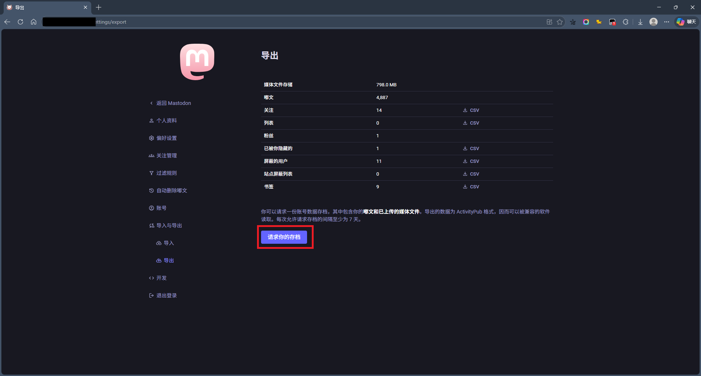

请求存档需要一点时间，等存档准备好后就下载你的存档

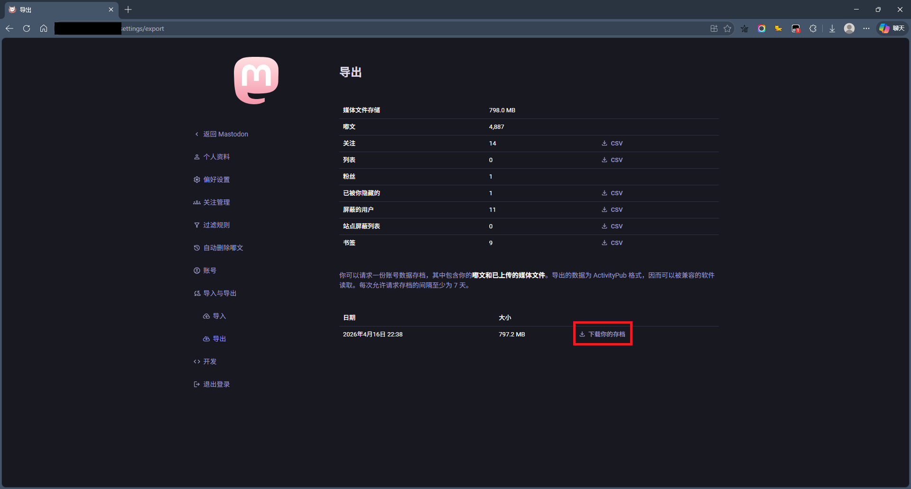

下载后你会得到如下的文件  
`media_attachments`里面存放着图片和视频等媒体文件  
`outbox.json`记录着所有的嘟文

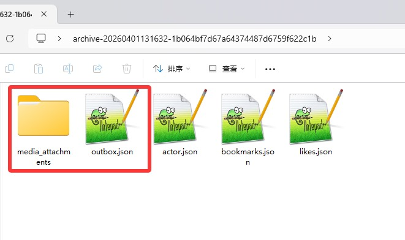


---

## 🛠️WordPress 的设置与主题安装

下面进行 WordPress 的设置（WordPress 的部署不在本教程范围内）  
这里以一个新部署好的 WordPress6.9 网站为例  
进入网站的后台页面

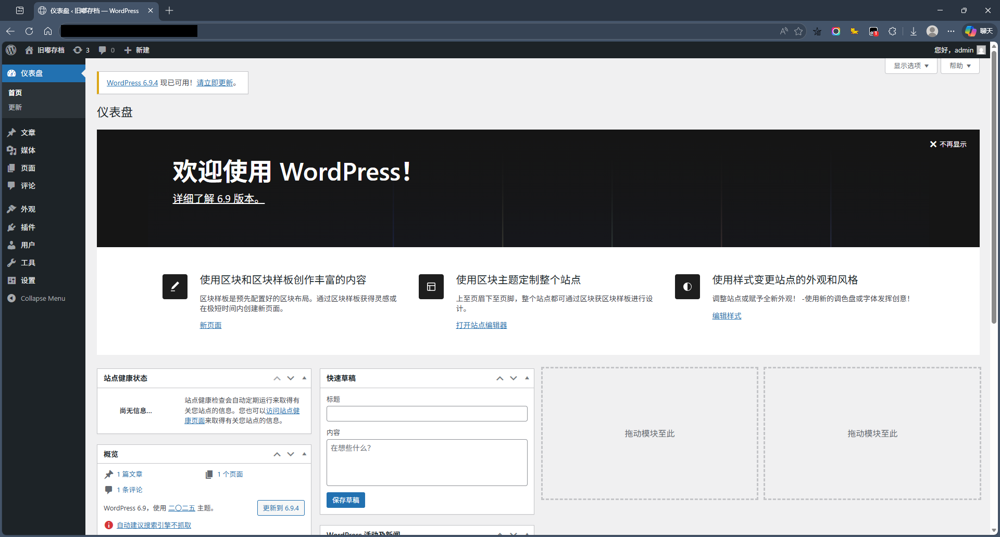

第一步，先安装导入嘟文必须用到的插件**Post Export Import with Media**  
在 WordPress 左边栏找到**插件**→**安装插件**  
搜索找到**Post Export Import with Media**，立刻安装并启用

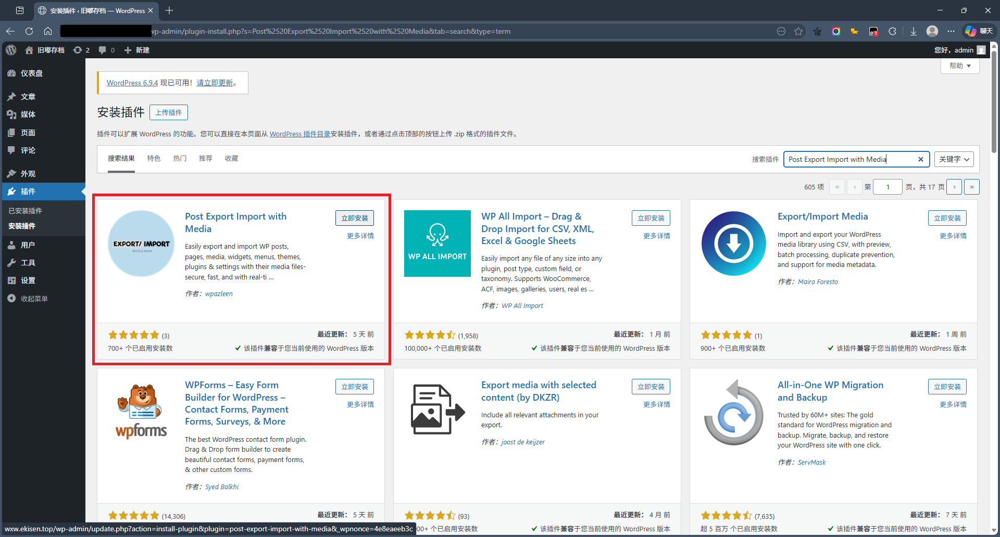

第二步，安装本项目准备好的主题文件  
（会装修 WordPress 的可以省略这步，这里仅为方便想快速看到整体博客效果的人）

先下载主题文件 [mastodon.zip](https://github.com/kunsui/mastodon_to_wordpress/raw/refs/heads/main/theme/mastodon.zip)

```
theme/mastodon.zip
```

在 WordPress 左边栏找到**外观**→**主题**→**安装主题**  
然后上传安装刚才下载好的主题文件`mastodon.zip`

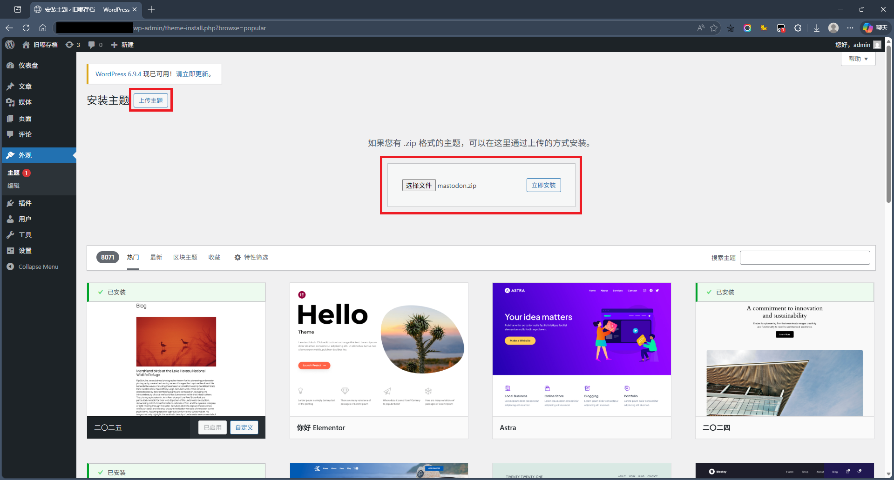

安装完成后回到主题界面，启用刚才安装的主题**Mastodon**

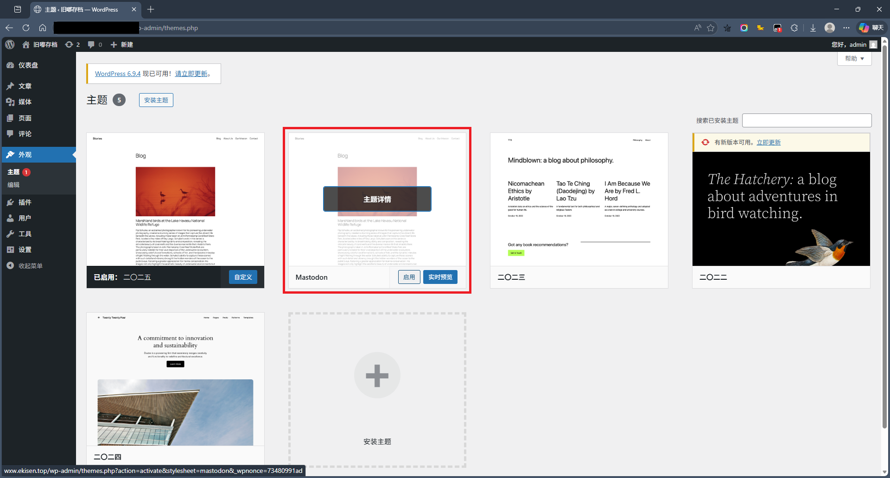

第三步，还有几个小设置需要设定一下  
在 WordPress 左边栏找到**设置**→**阅读**  
**博客页面至多显示**这一项，建议设置为**50**以上

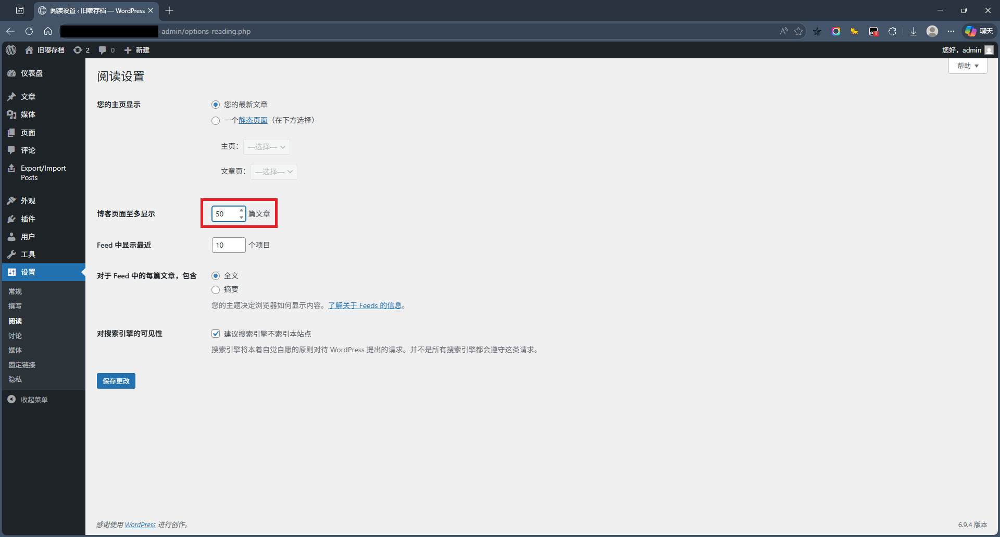

继续在左边栏找到**设置**→**固定链接**  
**固定链接结构**这一项，建议设置为**朴素**

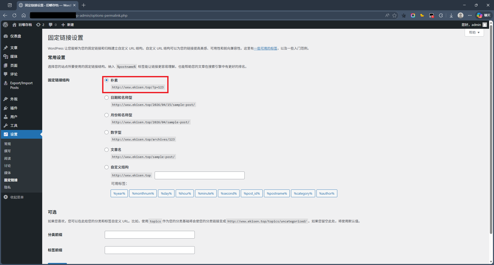

以上，WordPress 的基本设置就结束了  
可以点击左上角的站点名称去到站点首页，查看当前的首页，大概是如下的样子

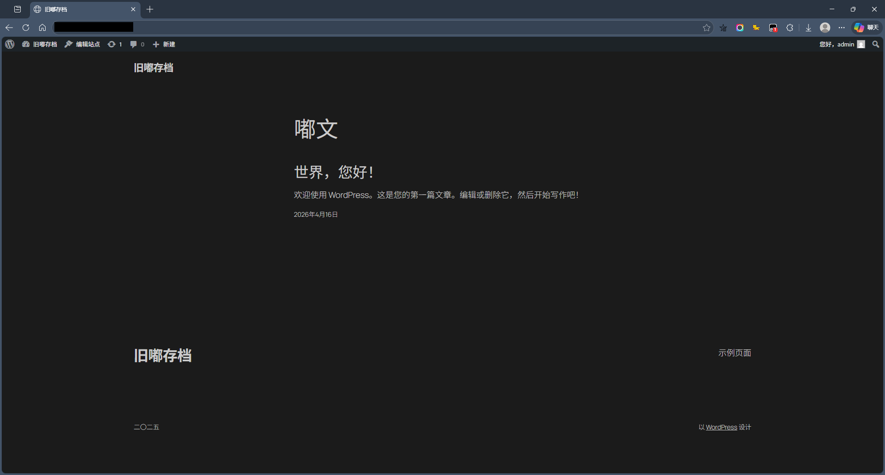


---

## 🪄媒体的导入与 JSON 导入插件的使用

记住必须**先导入媒体**，**后导入嘟文**  

在 WordPress 左边栏找到**媒体**，进入媒体库  
导入 Mastodon 的媒体之前，可以先保存下面这张图片，上传到媒体库  
（用于作为含视频的文章的特色图片，可以省略这一步，只是特色图片会变空白）


```
images/video.png  # 不要改动名字
```

接着把从 Mastodon 导出的媒体文件全部上传到媒体库  
把媒体文件夹 `media_attachments\files` 整个拖入媒体库就能上传全部文件

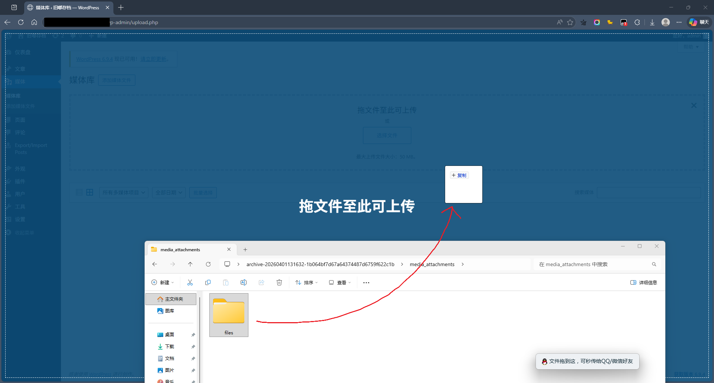

大量的媒体文件需要等网页反应一会儿，就能看到上传中的画面  
请停留在这个画面等待所有媒体文件上传完成

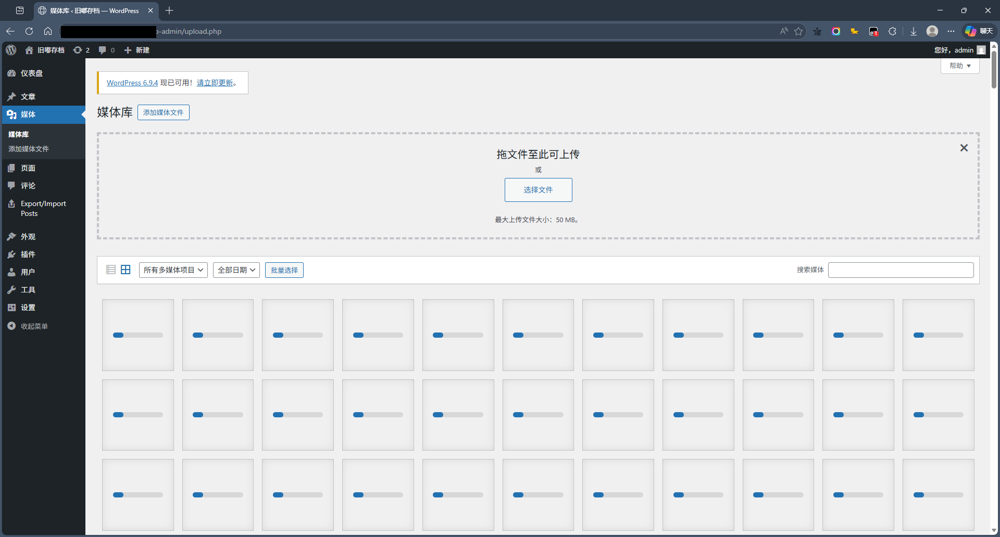

等待媒体上传的过程中就可以进行嘟文的格式转换  
从 Mastodon 导出的原始格式转换为可用于 WordPress 导入的格式

下载本项目打包好的格式转换可执行文件 [mastodon2wordpress.exe](https://github.com/kunsui/mastodon_to_wordpress/raw/refs/heads/main/dist/mastodon2wordpress.exe)

```
dist/mastodon2wordpress.exe
```

把从 Mastodon 导出得到的 `outbox.json` 文件拖到 `mastodon2wordpress.exe` 上执行

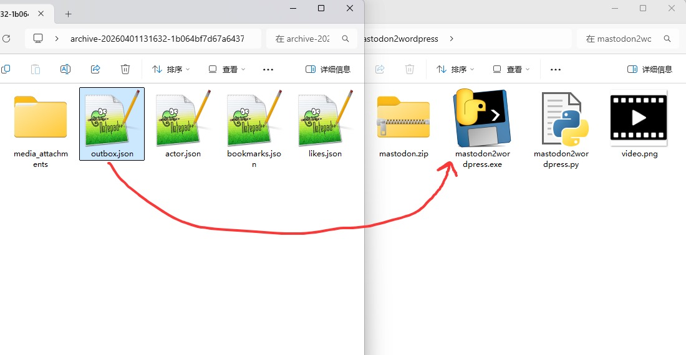

接着会弹出一个黑框框，输入你 WordPress 网站的URL和起始文章编号，按回车开始转换

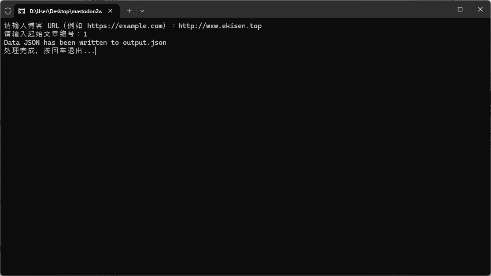

> 起始文章编号：脚本会按嘟文的顺序用1,2,3,4的编号作为WordPress文章的标题，起始编号通常为1  
> 导入插件默认以文章标题是否一致来判断文章是否重复导入，重复文章的会被跳过  
> 进行多次导入时请注意文章的标题编号不要重复，二次导入时可以接着上一次的最后编号+1作为起始编号

转换完成后会在 `outbox.json` 文件的**相同目录下**生成一个 `output.json` 文件  
这个就是要用来导入到 WordPress 的文件

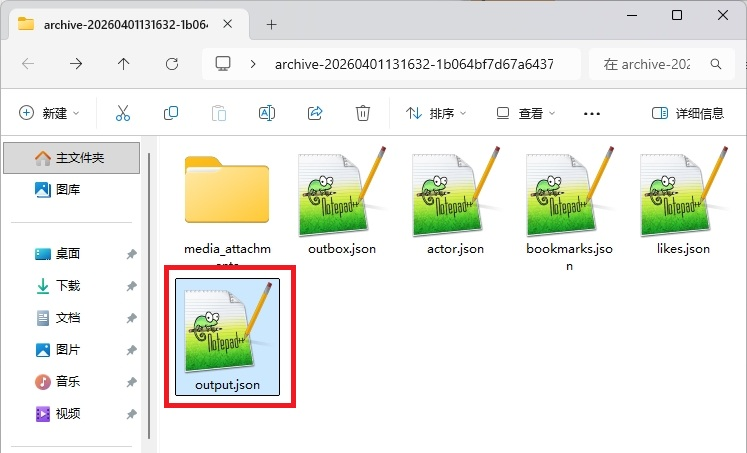

得到了转换后的文件后，等媒体上传完成就可以进行嘟文的导入了  
在 WordPress 左边栏找到 **Export/Import Posts**（刚才安装的导入插件）  
在插件的**Import Posts**栏上点击**Select JSON File**，选择转换得到的文件 `output.json`  
下面的选项**只勾选第一个选项**，**取消勾选第二个选项**

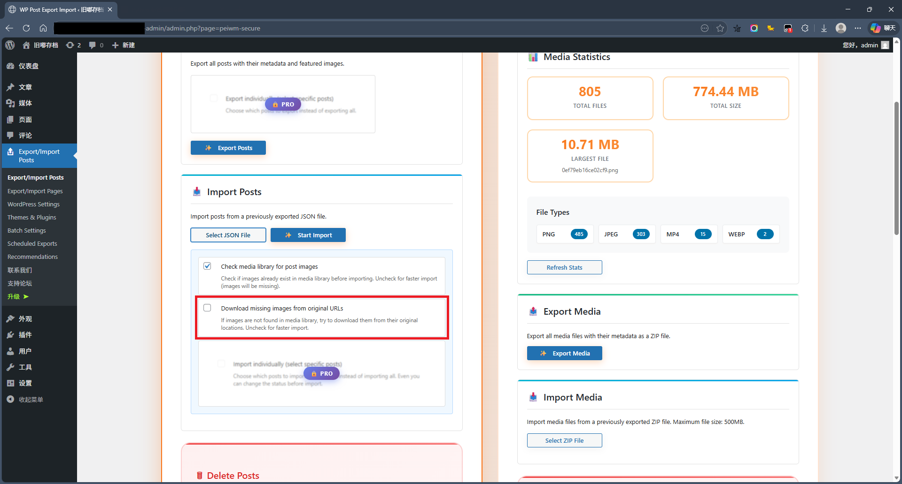

然后点击**Start Import**，就开始导入文章了  
大量的嘟文需要较长的时间才能导入完成，请不要刷新或关闭这个页面

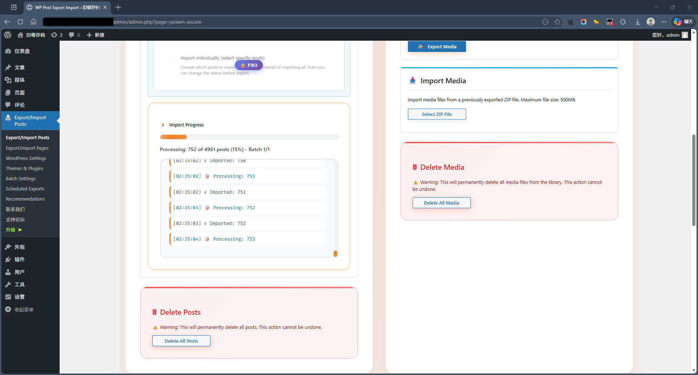

全部导入完成后会有弹窗提示

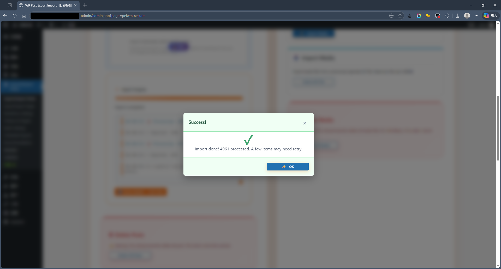

在导入大量数据时，通常会有小部分数据丢失，点击**Let's retry**就可以把丢失的数据重新导入  
至此所有的导入流程就结束了

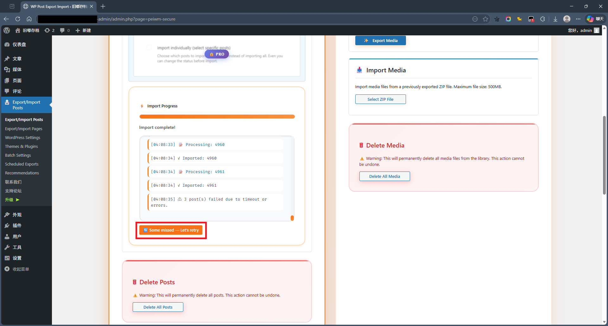


---

## 😊看看成果

回到 WordPress 的主页看看，就能见到满满的嘟文了

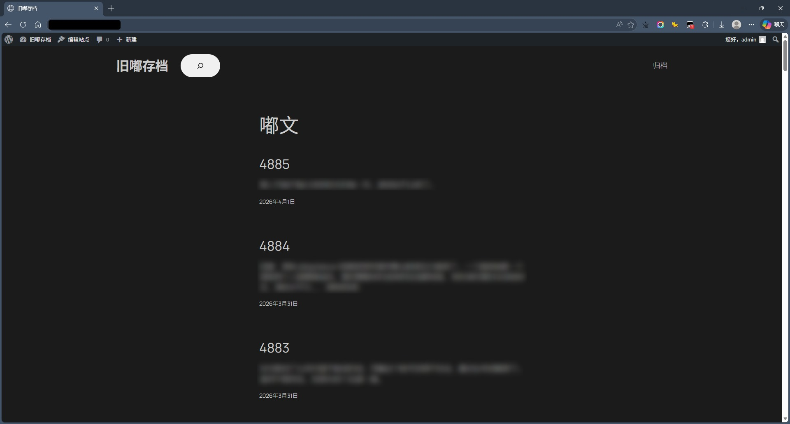

归档页面可以看到带有文章特色图片展示的界面

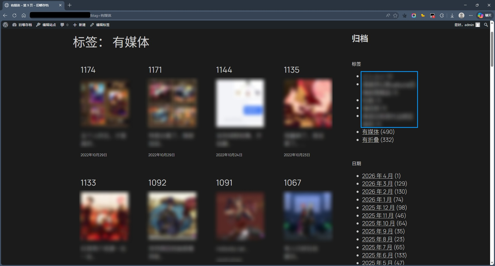

以上，结束！

